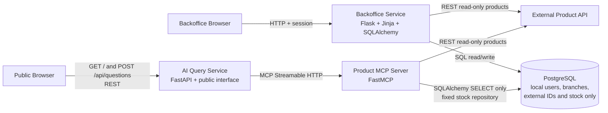

# Architecture

## Overview

HBntory is a monorepo with three main application blocks: the Backoffice Service, the Product MCP Server, and the AI Query Service. PostgreSQL stores local business data. The official read-only [hbtn-edu/hbntory-products-api](https://github.com/hbtn-edu/hbntory-products-api) service remains the source of truth for the product catalog.

The public web interface is part of the AI Query Service. It is not a separate Docker service. Docker Compose will eventually run PostgreSQL, the external Product API, the Backoffice, the MCP server, and the AI service.

## Target repository structure

This is the target structure. The project implements it incrementally without creating empty application files in advance.

```text
hbntory-inventory-platform/
├── backoffice/
│   ├── app/
│   │   ├── templates/
│   │   └── static/
│   ├── tests/
│   ├── Dockerfile
│   ├── requirements.txt
│   └── README.md
├── product_mcp_server/
│   ├── app/
│   ├── tests/
│   ├── Dockerfile
│   ├── requirements.txt
│   └── README.md
├── ai_service/
│   ├── app/
│   │   ├── templates/
│   │   └── static/
│   ├── tests/
│   ├── Dockerfile
│   ├── requirements.txt
│   └── README.md
├── docs/
│   ├── architecture.md
│   ├── decisions.md
│   ├── database.md
│   ├── api-contracts.md
│   ├── mvp.md
│   ├── team-organization.md
│   └── test-plan.md
├── .github/
│   └── pull_request_template.md
├── .env.example
├── .gitignore
├── docker-compose.yml
└── README.md
```

## Components and responsibilities

### Backoffice Service

Planned technologies: Python, Flask, Jinja, SQLAlchemy, PostgreSQL, Flask-Login, and Werkzeug PBKDF2 password hashing.

Responsibilities:

- authenticate internal users and manage sessions;
- enforce administrator and common-user roles;
- manage branches, users, and stock according to role permissions;
- retrieve product display data from the external Product API;
- render the internal interface on the server with Jinja.

Authorization and business rules:

- a common user belongs to exactly one branch and manages only that branch's stock;
- a common user cannot manage users;
- an administrator can manage users but cannot perform stock operations;
- deleted users use soft delete and cannot sign in;
- stock quantity can never be negative;
- stock additions and removals accept positive integers only.

### Relational Database

PostgreSQL stores only users, branches, stock quantities, and the canonical numeric external product identifier in `external_product_id`. Product names, SKU values, descriptions, prices, images, and external metadata are never copied into the local database.

### External Product API

The official [External Product API repository](https://github.com/hbtn-edu/hbntory-products-api) is an independent, already-developed dependency. It is read-only, belongs to the product catalog domain, and must not be modified or copied into HBntory. It can be started separately with the Docker Compose configuration provided in its own repository.

The API supplies product identifiers, SKU values, names, descriptions, categories, brands, suppliers, prices, currencies, tags, discontinued status, and product metadata. It does not supply stock quantities, reserved units, available quantities, reorder thresholds, storage locations, or branch stock. HBntory owns all stock data in PostgreSQL.

Both the Backoffice and Product MCP Server consume this API. They must read its base URL from `PRODUCT_API_URL` because the correct value depends on the execution mode:

| Execution mode | `PRODUCT_API_URL` |
| --- | --- |
| API started from its own repository and accessed from the host | `http://localhost:5001` |
| HBntory containers access an API exposed separately on the host | `http://host.docker.internal:5001` |
| All services directly share the API's Docker network | `http://external-products-api:5000` |

The Product MCP Server HTTP client (`ProductApiClient`) uses an explicit timeout (`PRODUCT_API_TIMEOUT`) and converts slow responses, network timeouts, unavailable services, forced HTTP errors, and invalid JSON into controlled errors. It never silently returns an empty list on connection failure.

### Product MCP Server

Technologies: Python, the official MCP Python SDK (FastMCP), httpx, and MCP Streamable HTTP between containers (`/mcp`).

**Implemented product tools:**

- `list_products` — read-only list/filter against `GET /api/v1/products`;
- `get_product_details` — read-only detail against `GET /api/v1/products/{id_or_sku}`.

**Implemented stock tools:**

- `get_product_stock` — positive availability for one external product across branches;
- `get_branch_stock` — positive product quantities for a branch selected by id or exact name;
- `check_shopping_list` — deterministic single-branch and multi-branch fulfillment analysis.

Internal layout separates environment configuration, the read-only SQLAlchemy repository, deterministic stock-query logic, MCP adapters, and the FastMCP entry point. Both the Product API client and stock repository are injectable, so tests use fakes or an isolated SQLite database and require no network.

Product tools read from the official External Product API only. Stock tools reuse the Backoffice `Branch` and `Stock` SQLAlchemy models without starting Flask. They use fixed parameterized `SELECT` statements against PostgreSQL, omit zero quantities, and never expose SQL supplied by an MCP caller.

Extending the existing internal MCP server is intentionally safer than exposing PostgreSQL to a generic database MCP: the access surface is limited to three contracts, arbitrary SQL is absent, validation is centralized, results and errors are stable for the future agent, and tests are deterministic. This read-only tool boundary is separate from authenticated Backoffice operations: MCP does not apply `admin`/`common` roles, but it also cannot add, remove, update, or delete stock, branches, or users.

### AI Query Service and public interface

Planned technologies: Python, FastAPI, one AI agent, and an MCP Streamable HTTP client.

FastAPI serves `GET /` for the public page and `POST /api/questions` for questions. The page assets live under `ai_service/app/templates/` and `ai_service/app/static/`. The browser uses REST; no WebSocket is required.

Each request is independent and has no conversation history. The agent calls only the MCP tools it needs, grounds its answer in tool results, never invents product data or quantities, and clearly reports unavailable or insufficient information.

The public page contains only a question field, a submit button, a loading indicator, a response area, and a clear error message.

### Docker Compose

Docker Compose defines PostgreSQL, the official Product API (built from the official GitHub source without modification), and the Product MCP Server. Backoffice and AI services will be added in later tasks. The Product MCP Server reaches the catalog through the configured Product API container port, reads stock through `DATABASE_URL`, waits for both dependencies to become healthy, and exposes Streamable HTTP on port `8001` (`/mcp`).

## Data ownership

| Data | Source of truth | Consumers |
| --- | --- | --- |
| Users and roles | PostgreSQL through the Backoffice | Backoffice only |
| Branches | PostgreSQL through shared SQLAlchemy models | Backoffice and controlled MCP stock queries |
| Stock quantities | PostgreSQL through shared SQLAlchemy models | Backoffice writes and controlled MCP reads |
| Canonical numeric `external_product_id` | PostgreSQL stock records | Backoffice and MCP |
| Product catalog and metadata | Official External Product API | Backoffice and MCP |

## Backoffice data flow

1. An internal user opens the Backoffice.
2. Flask authenticates the user with a session.
3. The backend checks the user's role and branch authorization.
4. SQLAlchemy reads or changes local data in PostgreSQL.
5. The Backoffice retrieves product details from the external Product API when needed for display.
6. The backend validates every operation before saving it.

## Public interface data flow

1. An anonymous user opens the page served by FastAPI.
2. The browser sends one question with `POST /api/questions`.
3. The AI agent analyses the independent question.
4. The agent calls the required Product MCP Server tools over Streamable HTTP.
5. MCP retrieves product data from the external Product API.
6. MCP retrieves stock through fixed, parameterized, read-only SQLAlchemy queries.
7. The agent creates an answer based only on the returned data.
8. FastAPI returns the response to the browser.

## Architecture diagram



## Stock-query boundaries

The MCP process imports the existing declarative models and database helpers but does not call the Flask app factory or use a Flask request/session. Its repository opens short-lived SQLAlchemy sessions and runs only predefined `select()` expressions. Query arguments become bound SQL parameters; no endpoint or tool accepts a table name, column name, predicate, or SQL fragment.

Repository failures are converted to `DATABASE_UNAVAILABLE`. Malformed internal records are converted to `INVALID_STOCK_RESPONSE`. Neither result includes a database URL, driver message, SQL statement, traceback, password hash, session data, or secret.

The future AI Query Service is the intended MCP client. This service-to-service read path does not inherit Backoffice roles: `admin` and `common` restrictions still govern authenticated Backoffice write operations, while MCP remains limited by its much smaller read-only tool surface.

## Shopping-list flow

1. Validate a non-empty item list; every `product_id` and `quantity` must be a positive integer and booleans are rejected.
2. Merge duplicate product identifiers by summing their requested quantities.
3. Load positive stock for only those external identifiers.
4. Return every branch that can satisfy the complete normalized list, ordered by `branch_id`.
5. If no single branch qualifies, allocate each product in ascending product-id order from branches ordered by quantity descending, then `branch_id` ascending.
6. Return the deterministic plan. If cumulative stock is insufficient, keep the safe partial allocation and report exact requested, available, and missing quantities with `fulfillable: false`.
