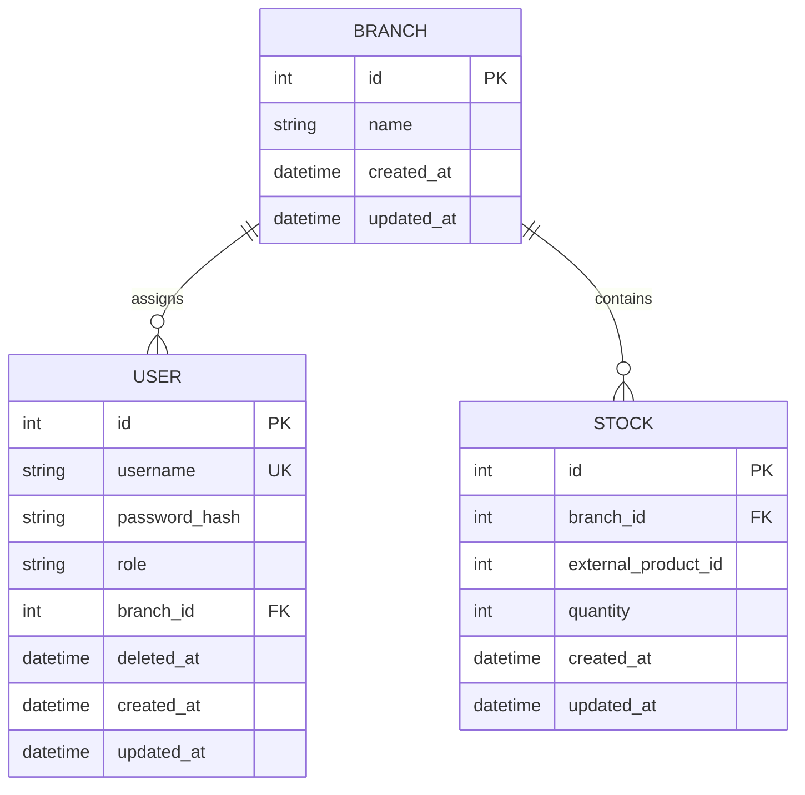

# Conceptual Database Schema

This document describes the Task 1 SQLAlchemy 2.x foundation. PostgreSQL is the production database, while automated unit tests use isolated SQLite databases with foreign-key enforcement enabled.

## User

| Field | Purpose |
| --- | --- |
| `id` | Unique user identifier. |
| `username` | Unique sign-in name. |
| `password_hash` | PBKDF2-SHA256 password hash; never a plain-text password. |
| `role` | Either `admin` or `common`. |
| `branch_id` | Assigned branch; nullable only for the administrator. |
| `deleted_at` | Nullable soft-delete timestamp. A non-null value means the user is deleted. |
| `created_at` | Creation timestamp. |
| `updated_at` | Last update timestamp. |

## Branch

| Field | Purpose |
| --- | --- |
| `id` | Unique branch identifier. |
| `name` | Branch name. |
| `created_at` | Creation timestamp. |
| `updated_at` | Last update timestamp. |

## Stock

| Field | Purpose |
| --- | --- |
| `id` | Unique stock-record identifier. |
| `branch_id` | Branch that owns the quantity. |
| `external_product_id` | Canonical numeric product identifier supplied by the external Product API. |
| `quantity` | Current non-negative quantity. |
| `created_at` | Creation timestamp. |
| `updated_at` | Last update timestamp. |

## Relationships

- one `Branch` can have many common `User` records;
- every common `User` belongs to exactly one `Branch`;
- the administrator has no branch stock responsibility;
- one `Branch` can have many `Stock` records;
- every `Stock` record belongs to exactly one `Branch`;
- `external_product_id` is an integer obtained from the external Product API;
- `external_product_id` is not a SQL foreign key because no external `Product` table exists in HBntory PostgreSQL.

## Constraints

- `User.username` is unique;
- `User.role` is limited to `admin` or `common`;
- a common user must have a non-null `branch_id`;
- an administrator must have a null `branch_id` and does not manage stock;
- branch names are unique without case sensitivity;
- `Stock.quantity` is greater than or equal to zero;
- `Stock.external_product_id` is a positive integer;
- the pair `Stock.branch_id + Stock.external_product_id` is unique;
- stock additions and removals must use positive integer amounts;
- soft-deleted users cannot authenticate;
- there is no local `Product` table.

## Product data boundary

PostgreSQL must not store product names, SKU values, descriptions, prices, images, or other Product API metadata. When a user selects a product by SKU, HBntory resolves it through the official API and stores only its canonical numeric `external_product_id`.

Allowed local stock representation:

```json
{
  "branch_id": 2,
  "external_product_id": 1,
  "quantity": 12
}
```



## Database constraints and indexes

| Name | Purpose |
| --- | --- |
| `uq_users_username` | Prevent duplicate usernames. |
| `ck_users_role` | Permit only `admin` and `common`. |
| `ck_users_role_branch` | Require a branch for common users and forbid one for administrators. |
| `uq_branches_name_lower` | Prevent duplicate branch names regardless of case. |
| `ck_stocks_quantity_non_negative` | Prevent stock below zero. |
| `ck_stocks_external_product_id_positive` | Require a positive canonical product identifier. |
| `uq_stocks_branch_external_product` | Permit one stock row per branch/product pair. |
| `ix_users_branch_id` | Support branch-user lookups. |
| `ix_stocks_branch_id` | Support branch-stock lookups. |
| `ix_stocks_external_product_id` | Support cross-branch product-stock lookups. |

`users.branch_id` and `stocks.branch_id` use foreign keys with `ON DELETE RESTRICT`. A branch that still owns users or stock cannot be deleted accidentally. The application must explicitly reassign or remove dependent data first.

## Validation boundaries

Database constraints guarantee relational integrity, allowed roles, role/branch consistency, unique values, valid foreign keys, non-negative quantities, and positive external product identifiers.

The `StockService` business layer guarantees that:

- additions and removals use integers greater than zero (booleans are rejected);
- the branch exists;
- the external product identifier has a valid integer shape;
- the injected `ProductValidator` confirms that the product exists;
- a removal cannot exceed the available stock.

The `ProductValidator` is an injectable boundary. Unit tests use a fake validator and never use the network. A real HTTP implementation will be added during Backoffice/Product API integration. No HTTP request occurs in a model or SQLAlchemy persistence event.

## Passwords and soft delete

`User.set_password()` hashes passwords with Werkzeug PBKDF2-SHA256 and a random salt. Clear-text passwords are never assigned to a database column or printed. `User.soft_delete()` sets `deleted_at` and keeps the row for audit and referential continuity. Authentication code will later reject rows whose `deleted_at` is not null.

## Initial schema strategy

Task 1 uses `Base.metadata.create_all()` to create missing tables for a new environment. It is an initial bootstrap strategy, not a permanent migration solution: it does not version or alter existing schemas. Before schema evolution begins, the team must adopt a proper migration workflow such as Alembic in a separate, reviewed task.

Create the initial schema from the repository root:

```bash
export DATABASE_URL='postgresql+psycopg://hbntory:<local-password>@localhost:5432/hbntory'
python -m backoffice.scripts.create_schema
```

## Idempotent initialization

The initializer creates, only when missing:

- the single initial `admin` user without a branch;
- the `Lille` and `Roubaix` branches;
- one stock row for official `external_product_id = 1` in each branch.

Product `1` was validated by the existing External Product API foundation. The initializer uses the injectable validation boundary with this documented identifier; it does not implement an HTTP client or copy product data.

`INITIAL_ADMIN_PASSWORD` is mandatory. Initialization fails clearly when it is missing or empty. The password is hashed before persistence and never logged. Re-running the command preserves existing rows and does not duplicate the administrator, branches, or stocks.

```bash
export INITIAL_ADMIN_PASSWORD='<strong-local-password>'
python -m backoffice.scripts.init_db
```

## Automated tests

Tests run against isolated SQLite databases and require no PostgreSQL container or network access:

```bash
python -m pytest backoffice/tests
```
